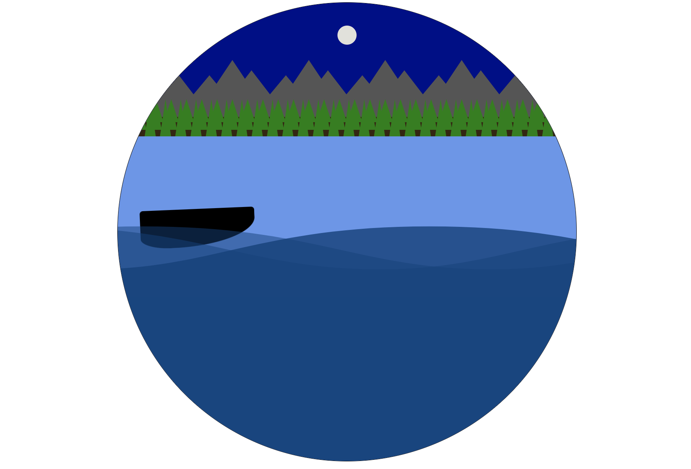

# About
This repository contains some example fun icons built purely with 
HTML and CSS.
These icons could be created using SCSS or LASS as well.

## Previews on CodePen

- [Girl coder - 1](https://codepen.io/shaqayeq/pen/LYBXzLP)
- [Banana](https://codepen.io/shaqayeq/pen/ZEjmdaz)
- [Lake night - animation](https://codepen.io/shaqayeq/pen/zYLyxzd)
- [Baby Yoda](https://codepen.io/shaqayeq/pen/mdjamJb)

## How they look
 

